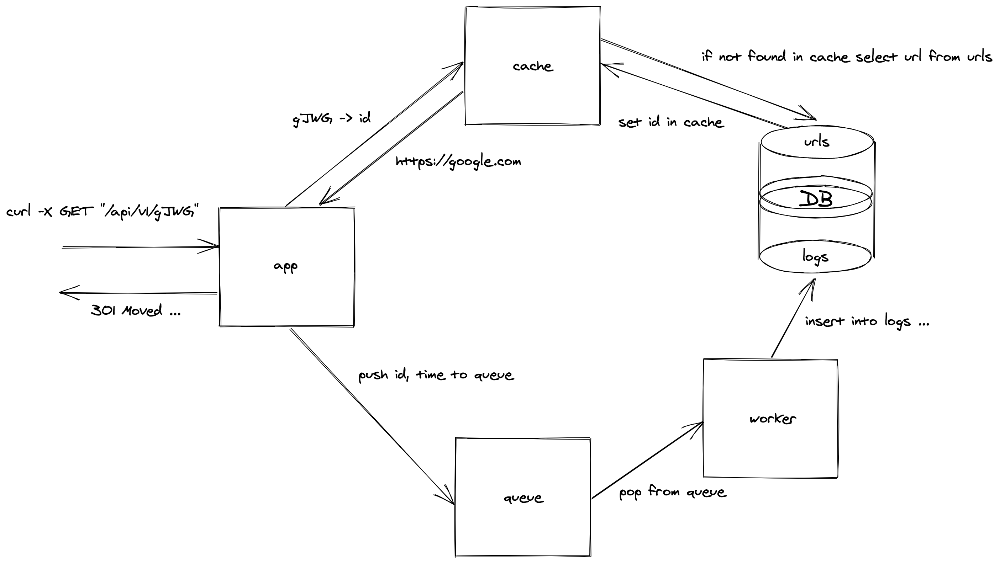

# Turl - tiny URL shortener

## Run

```bash
git clone https://github.com/fredeastside/turl.git ./turl
cd turl
make start
```
Try to send curl requests.

## Tech stack
1. Go
2. PostgreSQL
3. Apache Kafka
4. Docker

## Dependencies

1. Router - [github.com/gin-gonic/gin](https://github.com/gin-gonic/gin)
2. Logger - [github.com/sirupsen/logrus](https://github.com/sirupsen/logrus)
3. Kafka client - [github.com/Shopify/sarama](https://github.com/Shopify/sarama)
4. Unique ID generator - [github.com/speps/go-hashids](https://github.com/speps/go-hashids)

## Endpoints
1. Create short URL
```bash
curl -X POST "http://0.0.0.0:8080/api/v1/" -d "url=https://google.com" -H "Content-Type: application/x-www-form-urlencoded"
```

2. Get redirected URL
```bash
curl -X GET "http://0.0.0.0:8080/api/v1/gJWG"
```
How it works


3. Get daily, weekly, all days report
```bash
curl -X GET "http://0.0.0.0:8080/api/v1/gJWG/report"
```

## Credentials and settings
Please, find it in ```.env``` file
```
APP_PORT=8080
WORKER_PORT=8081
DB_NAME=mydb
DB_USER=myuser
DB_PASSWORD=mysecretpassword
DB_PORT=5432
DATABASE_URL=postgres://myuser:mysecretpassword@db/mydb?sslmode=disable
GIN_MODE=release
ZOOKEEPER_PORT=2181
KAFKA_HOST=kafka
KAFKA_PORT=9092
UID_SALT=6.2Wghz6TjiH8_m)iErw3BDlR+dbI2Z!jfkH
UID_MIN_LEN=4
```

## Tests
```bash
make test
```

## Up/Stop

```bash
make up
```

```bash
make stop
```